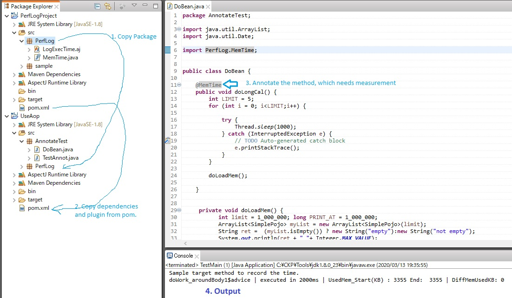
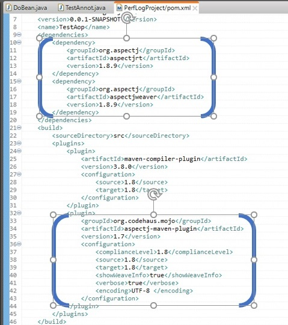

# PerformanceLogging

This is a maven project. To use it you need to download it and import in local eclipse. Then copy the package PerfLog from this project into your maven project in which you want to measure the performance parameters (this tool meaures the execution time and memory utilized). After that copy the dependencies and plugin from this projects pom.xml into your maven project.   

Step 1: Copy the PerfLog, as shown below, from this project, and paste into your maven project.  
Step 2: Copy the dependencies and plugin from this project pom.xml, as shown below, into your maven projects's pom.xml  
Step 3: In your maven project, suppose you want to track the execution and memory consumption in a particular method, say, the method name is "doLongCal()". To automatically trace its execution time and memory utilization, just annotate it as shown below.  

The output will show the execution time and the memory used by this method.   

  
In Step 2, the dependencies and plugin which needs to be copied from this project pom.xml, into your maven projects's pom.xml are shown below: 

Thank you.
